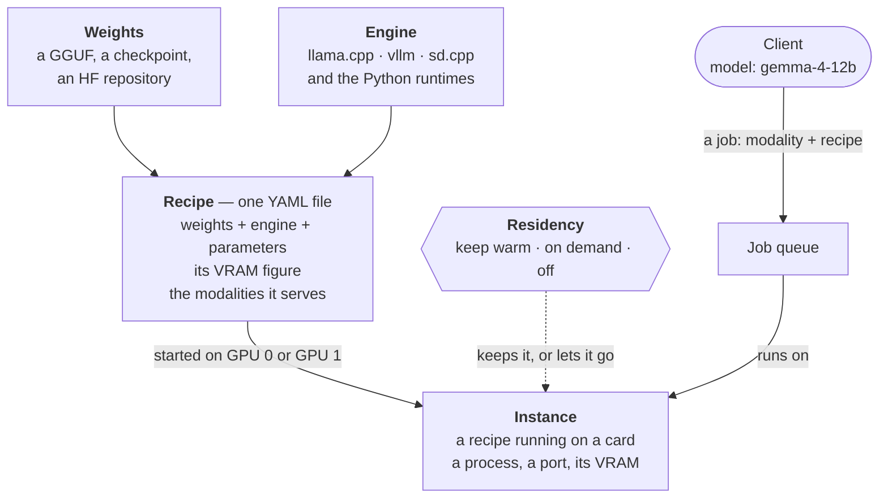

<!--
SPDX-FileCopyrightText: 2026 vikworks UG (haftungsbeschränkt)

SPDX-License-Identifier: Apache-2.0
-->

# giq

**GPU Inference Queue** — one local service that owns your GPUs and serves
LLM, image, speech, OCR and depth models to every client on the machine
through a single job queue.


## Features

- **One way in.** Every request — the job API, the OpenAI-compatible routes,
  the OCR and depth endpoints — goes through one job queue, so clients
  never race each other for VRAM. Jobs carry batches of tasks.
- **OpenAI-compatible API.** `/v1/chat/completions` with streaming and tool
  calls, `/v1/responses`, `/v1/models`, `/v1/audio/transcriptions`,
  `/v1/audio/speech` and `/v1/audio/embeddings` — point an existing client
  at it.
- **Many modalities, local engines.** LLMs via llama.cpp (vision via
  `--mmproj`, speculative decoding via `--spec-type`); text-to-image and image
  edit via stable-diffusion.cpp; speech to text with diarization
  (faster-whisper + pyannote); text to speech (Kokoro); speaker voiceprints
  (ECAPA-TDNN); OCR (Unlimited-OCR, GLM-OCR); depth (Depth Anything V2).
- **Recipes, not code.** Every model giq serves is a recipe: one YAML file
  naming its weights, the engine that runs them, the engine's parameters and
  a measured VRAM figure. Clients ask for a recipe by name; your own files
  add recipes or replace the built-ins.
- **Residency you choose.** Each recipe is *keep warm*, *on demand* or *off*,
  changeable at runtime and persistent. Before a load, a VRAM gate checks the
  recipe's declared figure — measured on real hardware, and marked as an
  estimate where it is not — against the card's free VRAM, and evicts
  keep-warm instances on that card if that is what it takes.
- **Multiple GPUs.** Bind a recipe to a card and it is gated against, loads
  on and evicts only on that card; used VRAM is split into what giq holds and
  what everything else does.
- **Records that a job ran, never what it said.** Prompts, images and outputs
  stay in memory; the stats database has no column one could go in, and a
  test pushes a canary through every logging path. Every advertised model is
  served locally — no request is forwarded to a hosted API.
- **Safe on loopback, explicit off it.** DNS-rebinding and cross-site requests
  are refused by Host/Origin checks; binding beyond loopback without a token
  is announced at startup and on the dashboard; an optional shared token
  guards everything.
- **Dashboard** at `/dash`: overview, the recipe catalog, the inventory of
  weights and engines on disk, usage and a sandbox (chat, tool calls,
  vision, image generation and edit, transcription, speech, voiceprints), in
  English and German, light and dark, with its fonts and icons bundled so it
  works without internet.


## How it works

Six terms, one meaning each ([ADR-003](docs/ADR-003-domain.md)):



- **Weights** are the files on disk; one checkpoint can serve several
  recipes, and the Inventory lists each once.
- An **engine** is the runtime that executes them.
- A **recipe** is weights + engine + parameters, with its VRAM figure
  (measured on real hardware, or marked as an estimate).
  Its name is what a client sends as `model`; it serves one or more
  **modalities** (`llm`, `text2image`, `ocr` …).
- An **instance** is a recipe running on a card. **Residency** decides
  whether it stays: *keep warm* (a resident instance, reloaded after
  eviction and on boot), *on demand* (started for a job, stopped when idle),
  or *off*.

A request names a recipe (`model`) and becomes a job, which waits in the
queue for an instance of that recipe — the recipe running on a card. If one
is up — a keep-warm (resident) instance, or the on-demand one that ran last —
the job runs at once; resident LLMs take several requests in parallel. If
not, giq checks the recipe's card: the declared VRAM figure plus a margin,
against what is free there now. When it does not fit, giq evicts resident
instances on that card until it does, runs the job, and the residents loop
brings the evicted ones back afterwards. An on-demand instance stops after
two idle minutes.

Instances run in their own processes — `llama-server`, `sd-server` or
`vllm serve` on a loopback port, or a Python child for the other engines —
started with `CUDA_VISIBLE_DEVICES` set to their card, so stopping one gives
its VRAM back. (Batch `stt` is the exception: faster-whisper runs inside
giq's process, and its CUDA context stays until giq restarts.)
`POST /control/pause` stops every instance and hands the GPUs back until
`/control/resume`.


## Quick start

Requirements: Linux, an NVIDIA GPU with `nvidia-smi` on PATH, Python 3.11+,
[uv](https://docs.astral.sh/uv/), Node.js 22.12+ for the dashboard, and for
LLMs a [llama.cpp](https://github.com/ggml-org/llama.cpp) build
(`llama-server`). Image models additionally need a
[stable-diffusion.cpp](https://github.com/leejet/stable-diffusion.cpp)
`sd-server`.

```bash
git clone <this repository> giq
cd giq
make sync        # uv sync and the dashboard
uv run python -m giq.main          # loopback, port 8084

# or with options
GIQ_MODELS_DIR=/data/models uv run python -m giq.main --host 127.0.0.1 --port 8084
```

`uv sync` alone installs giq and its curated plugins (image generation,
speech, OCR, depth, vllm), each a package of its own; `make ui` builds just
the dashboard. giq's core installed alone serves LLMs through llama.cpp,
with no torch: see [docs/plugins.md](docs/plugins.md) for choosing plugins
and writing one.

Then open `http://localhost:8084/dash`.

Model weights are not shipped; giq fetches them from the Hugging Face Hub
when you add a recipe. It first shows what that takes — download size, a
card it fits, free disk, access to gated repositories, the licence:

```bash
uv run giq add gemma-4-12b --dry-run   # the plan
uv run giq add gemma-4-12b             # the plan, then the fetch
```

The dashboard's Recipes page shows what is on this machine, and its Add
page everything else, with the same plan and a fetch button. Weights go
under `~/models` (or `GIQ_MODELS_DIR`); the weight paths in the recipe files
are relative to that directory, so files you place there yourself count
too. Paths, engines and GPUs are set in `config.yaml` — see
[docs/configuration.md](docs/configuration.md#getting-a-recipes-weights).

Each model comes with its own licence, and checking it for your use is up to
you; the plan shows it before anything is fetched. The built-in recipes'
weights are Apache-2.0 or MIT, and the pyannote diarization pipeline is
CC-BY-4.0 and gated on the Hugging Face Hub. Non-commercial models are
deliberately not registered.

## API in brief

```bash
# OpenAI-compatible chat (add "stream": true for server-sent events)
curl http://localhost:8084/v1/chat/completions \
  -H 'content-type: application/json' \
  -d '{"model": "gemma-4-12b", "messages": [{"role": "user", "content": "Hello!"}]}'

# The job API: any modality, a batch of tasks; ?wait=true returns the result
curl -X POST 'http://localhost:8084/run?wait=true' \
  -H 'content-type: application/json' \
  -d '{"modality": "text2image", "model": "flux_klein",
       "tasks": [{"id": "1", "prompt": "A sunset over mountains"}]}'
```

## Documentation

- [API](docs/api.md) — the job API, every endpoint, task shapes per modality, OCR,
  depth and vision
- [Configuration](docs/configuration.md) — `config.yaml`, environment
  variables, residency, multiple GPUs, the systemd service
- [Access and privacy](docs/access-and-privacy.md) — what is recorded, the
  Host/Origin rules, the token, leaving loopback
- [Deployment](docs/deployment.md) — a Debian server as a systemd service,
  one data directory (`GIQ_HOME`), reverse proxy, updates and backups
- [Engines](docs/engines.md) — llama.cpp, stable-diffusion.cpp and the
  interpreters giq runs models with
- [Plugins](docs/plugins.md) — the curated plugins, installing core alone
  or with a few, and writing one (engines, modalities, routes, recipes,
  dashboard panels)
- [Development](docs/development.md) — tests, the dashboard, languages,
  architecture
- Design decisions: [ADR-001](docs/ADR-001-ontology.md),
  [ADR-002](docs/ADR-002-model-instances.md),
  [ADR-003](docs/ADR-003-domain.md) (the terms: engine, weights, recipe,
  instance, residency, modality), [ADR-004](docs/ADR-004-plugins.md)
  (plugins), [ADR-005](docs/ADR-005-getting-recipes.md) (getting recipes)

## Contributing

Issues and pull requests are welcome. Run `make test` and `make check` before
sending one. New files need a REUSE header:
`reuse annotate --copyright "vikworks UG (haftungsbeschränkt)" --license Apache-2.0 <file>`.

## License

giq is developed by [vikworks](https://vik.works).

Apache-2.0 — see [LICENSE](LICENSE) and [NOTICE](NOTICE). Copyright 2026 vikworks UG (haftungsbeschränkt).
The project follows the [REUSE](https://reuse.software) specification: every file
carries an SPDX header; `reuse lint` checks it.
